## React Essentials – What This Section Is About

In this **React Essentials** section, we will build a **complete demo web application from scratch** using React.

During this process, you will learn the **core React concepts** that are required for *any* React application, regardless of its size or complexity.

### What you will learn
- **Components** – the fundamental building blocks of React
- **JSX** – writing UI with HTML-like syntax inside JavaScript
- **Props** – passing data between components
- **Rendering data** in the UI
- **Handling user events** (e.g. button clicks)
- **State** – managing dynamic, interactive data

### Outcome
By the end of this section, you will:
- Understand all **fundamental React concepts**
- Be able to build **static and dynamic React applications**
- Know how to turn static UIs into **interactive web apps**

### Prerequisites
- No prior React knowledge required
- Basic **JavaScript knowledge** is sufficient

## React Core Concept: Components

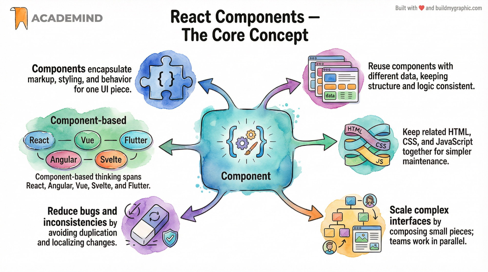

If you had to identify **one single core concept** that every React application relies on, it would be **Components**.

### What are Components?
Components are **reusable building blocks** of a user interface.  
A React application is built by **combining many small components** into a complete UI.

Each component typically:
- wraps **HTML (via JSX)**
- may include **CSS**
- contains **JavaScript logic**
- controls **one specific part of the UI**

### Thinking in Components
User interfaces can naturally be broken down into components.

For example, in a typical app you might identify:
- a **Header**
- a **Content section**
- a **Tabs / Navigation section**
- repeated **UI items** (cards, list entries, buttons)

How large or small a component should be is a **developer decision**.  
There is no single “correct” size.

### Why Components Matter

#### 1. Reusability
The same component can be reused multiple times with different data.

- Same structure
- Same styling
- Same logic
- Different configuration (data)

This reduces duplication and errors.

#### 2. Maintainability
Without components:
- HTML becomes large and hard to navigate
- Changes must be repeated in multiple places

With components:
- Code is defined once
- Changes are made in a single location

#### 3. Related Code Stays Together
Instead of separating:
- HTML in one file
- JavaScript in another

Components keep:
- markup
- logic
- styling

**closely coupled**, making changes safer and easier.

#### 4. Separation of Concerns
Each component has a **clear responsibility**.

Example:
- Some components display data
- Others handle user input
- Others manage navigation or state

This becomes increasingly important as applications grow and as **multiple developers** work on the same project.

### Not Just React
The component-based approach is widely used:
- Angular
- Vue
- Svelte
- Mobile frameworks like Flutter

This makes component thinking a **fundamental UI development skill**, not just a React concept.

---

## Getting Started with the React Project

Now that the **idea behind components** is clear, it’s time to switch from theory to practice and start working **inside a real React project**.

### Project Setup Options
You can follow along in **two equivalent ways**:

### Option 1: CodeSandbox (Browser-based)
- Use the **CodeSandbox link** attached to this lecture  
- No local setup required  
- No commands to run  
- Everything is preconfigured and runs automatically  

This is the fastest way to get started.

### Option 2: Local Development
If you prefer working locally:

1. Download the **ZIP file** attached to this lecture  
2. Extract it on your system  
3. Open the extracted folder in a code editor (e.g. **Visual Studio Code**)  

### Running the Project Locally

From the project root directory:

1. **Install dependencies** (run once):

```
npm install
```

This installs:
- React libraries  
- Build tools  
- Development server tooling  

2. **Start the development server**:

```
npm run dev
```

This:
- Starts a local dev server  
- Outputs a local URL  
- Watches your files and reloads the app on changes  

3. Open the displayed URL in your browser to see the app.

### Development Workflow
- Keep the dev server running while coding  
- Stop it with **Ctrl + C** when you’re done  
- Restart anytime with `npm run dev`  

### Important Notes
- React code **does not run directly in the browser**  
- The build process transforms React/JSX into browser-compatible JavaScript  
- CodeSandbox handles all of this automatically for you  

Regardless of whether you use CodeSandbox or a local setup, **the starting project and demo app are identical**.

---

Next, we will dive directly into the project and start creating **our first React component**.

## Understanding the Starting React Project Structure

With the starting project up and running, let’s take a closer look at **how a React app is structured** and **where the UI you see on the screen actually comes from**.

---

## index.html – Why It Looks Almost Empty

Inside the project folder, you’ll find an `index.html` file.

When you open it, you’ll notice:
- It contains only **minimal HTML markup**
- It does **not** include the image, title, or visible page content

This is **intentional**.

### Key Idea
In a React application:
- **React renders the UI**
- The HTML file only provides a **mounting point**

Typically, this file contains:
- Basic `<head>` configuration
- A single `<div>` (often with an `id="root"`)
- A reference to a JavaScript entry file

---

## index.jsx – The Entry Point

The `index.html` file loads a JavaScript file called `index.jsx`.

You’ll find it inside the `src/` folder.

This file:
- Is written in JavaScript
- Acts as the **starting point** of the React application
- Connects React to the HTML page
- Imports the main application component (`App`)

At this stage, you still won’t see any actual UI markup here.

---

## App.jsx – Where the UI Comes From

The **real UI markup** lives in `App.jsx`.

This file:
- Contains what looks like **HTML inside JavaScript**
- Has a `.jsx` extension
- Defines a **React Component**

This can feel confusing at first, but it’s one of the core ideas behind React.

---

## JSX – JavaScript Syntax Extension

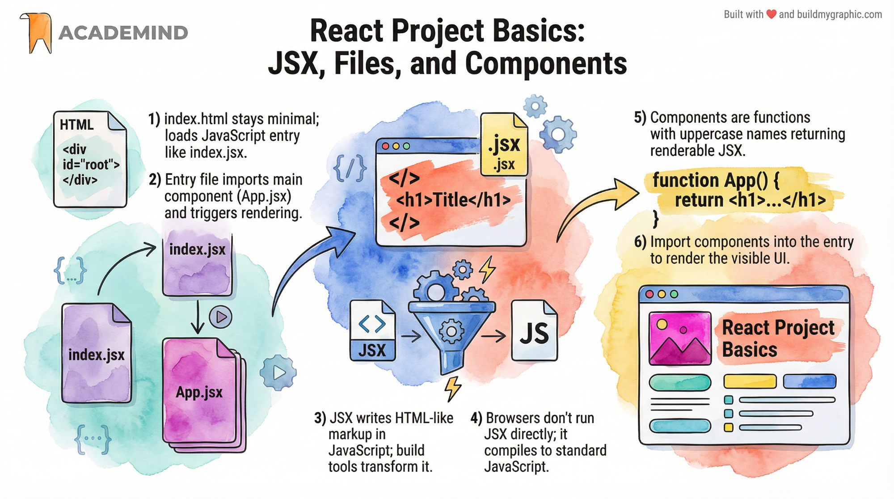

The `.jsx` extension indicates that the file uses **JSX**.

### What JSX Is
- JSX stands for **JavaScript Syntax Extension**
- It allows you to write **HTML-like markup inside JavaScript**
- It is **not standard JavaScript**
- Browsers **cannot run JSX directly**

### How JSX Works
- During development, JSX is transformed into plain JavaScript
- This transformation is handled by the **build tool / dev server**
- The browser only ever receives **regular JavaScript**

### Why JSX Is Used
- Writing UI with JSX is more readable
- It keeps UI structure close to the logic that controls it
- It is the standard way to build React interfaces

---

## React Components – The Core Concept

The `App.jsx` file defines a **React Component**.

### What a React Component Is
In React, a component is simply:
- A **JavaScript function**

But to be treated as a component by React, it must follow **two rules**:

1. **The function name must start with an uppercase letter**
2. **The function must return a renderable value**, typically JSX

### Example Structure (Conceptual)
```
function App() {
  return (
    <div>
      <h1>Hello React</h1>
    </div>
  );
}
```

That’s it.

No special syntax beyond:
- A normal JavaScript function
- A capitalized name
- A JSX return value

---

## Why This Matters

This simple pattern:
- Makes components easy to create
- Allows you to split complex UIs into small, reusable parts
- Is the foundation of **every React application**

Everything else in React builds on this idea.

---

## What’s Next

Now that you understand:
- Where the UI comes from
- What JSX is
- What a React component actually is

We’re ready to **create our first custom React component** and start building the UI ourselves.

## Creating and Using Your First Custom React Component

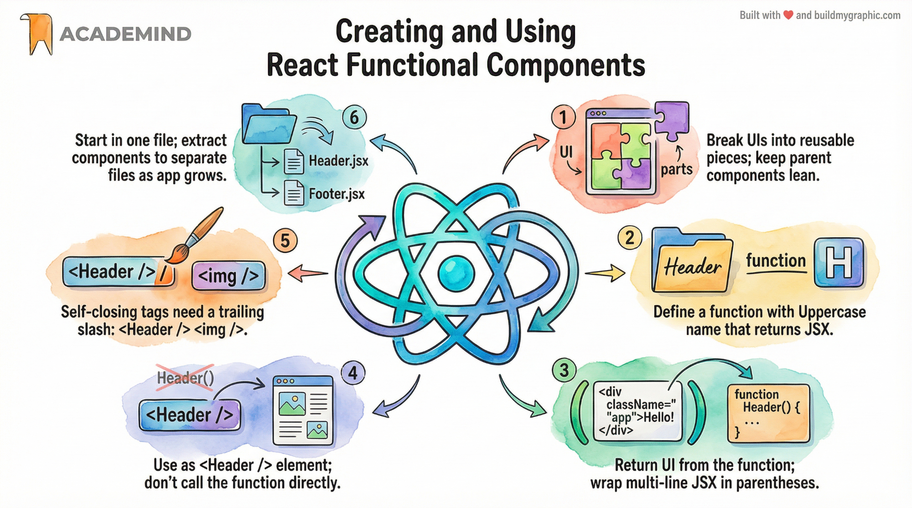

When building React applications, you are **not limited to a single component** like `App`.

In fact, real-world React apps typically consist of **dozens or even hundreds of components**, each responsible for a specific part of the user interface.

---

## Why Create Custom Components?

Splitting your UI into smaller components allows you to:

- Keep components **lean and readable**
- **Reuse UI logic and markup**
- Improve **maintainability**
- Clearly separate different parts of the UI

For example, in this demo app, the **header section** is a perfect candidate for extraction into its own component.

---

## Step 1: Define a New Component

React components are **just JavaScript functions**.

You can define a new component directly in `App.jsx` (for now) by creating a new function **above** the `App` component.

### Rules for React Components
A function is treated as a React component if:
1. Its name **starts with an uppercase letter**
2. It **returns JSX**

### Example: Header Component
```
function Header() {
  return (
    <header>
      <!-- header markup goes here -->
    </header>
  );
}
```

---

## Step 2: Move JSX into the Component

To extract the header:
- Cut the header-related JSX from the `App` component
- Paste it into the `Header` component’s return statement

### Important JSX Rule
When returning **multi-line JSX**, you must wrap it in **parentheses**:

```
return (
  <div>
    <h1>Title</h1>
    <p>Subtitle</p>
  </div>
);
```

Most editors (VS Code, CodeSandbox) handle this automatically when formatting or saving the file.

---

## Step 3: Use the Component Inside App

Unlike normal JavaScript functions, **you do not call React components manually**.

Instead, you use them **like HTML elements inside JSX**.

### Using a Custom Component
```
function App() {
  return (
    <div>
      <Header />
    </div>
  );
}
```

### Key Notes
- Component names **must start with uppercase letters**
- Components can be written as:
  - `<Header></Header>`
  - `<Header />` (self-closing, most common)

---

## Self-Closing Component Syntax

If a component has **no children**, you can (and usually should) use the self-closing syntax:

```
<Header />
```

⚠️ The forward slash (`/`) is **mandatory**, just like with built-in tags such as ``.

---

## Result

After saving the file:
- The UI looks the same as before
- But now the header is rendered via a **custom component**

This confirms:
- The component was created correctly
- React is executing the component function internally
- JSX is being rendered as expected

---

## Why This Is a Crucial Step

You’ve now learned:
- How to **define your own React components**
- How to **reuse them inside other components**
- How React treats components as **building blocks**

This is the **foundation of all React development**.

From here on:
- You’ll keep extracting components
- Passing data between them
- Making them interactive

This is exactly how real React applications are built.

## How React Components End Up on the Screen

Now that we created our **first custom component**, it’s important to clearly understand **how its content actually appears in the browser**.

This section explains the **full rendering pipeline**, from your React code to visible HTML in the browser.

---

## Inspecting the Page Source: Where Is the UI?

If you inspect the **page source** in the browser, you’ll notice something important:

- You **do not** see:
  - The header
  - The image
  - The titles
  - Any visible UI content
- You only see:
  - Basic metadata
  - A reference to one or more JavaScript files

This is expected behavior in a React application.

### Why?
Because **React renders the UI at runtime**, not via static HTML.

---

## index.html: The Entry Point

The `index.html` file is the file served to the browser.

It contains:
- Minimal HTML
- A single root element (e.g. `<div id="root"></div>`)
- A script import (e.g. `index.jsx`)

This file **does not contain the UI** itself.

---

## index.jsx: Bootstrapping the React App

The JavaScript file loaded by `index.html` (e.g. `index.jsx`) is critical.

This file:
- Imports React and React DOM
- Imports the `App` component
- Starts (boots) the React application

Even though the file extension is `.jsx`, what the browser actually executes is **transformed JavaScript**, not JSX.

---

## App.jsx: Where Your UI Starts

The `index.jsx` file imports the **App component** from `App.jsx`.

That component:
- Is a regular JavaScript function
- Returns JSX
- Represents the **root of your component tree**

This import/export mechanism:
- Uses standard JavaScript `import` / `export`
- Is **not React-specific**

---

## Why JSX Appears Outside a Component (Once)

In `index.jsx`, you’ll notice JSX being used **outside of a component function**.

This is the **only real exception** in a React app.

Why?
Because `index.jsx`:
- Is the **entry point**
- Bootstraps the entire React application
- Passes JSX directly into React’s rendering system

---

## ReactDOM, createRoot, and render

React does not magically render your app.

It uses **React DOM**, a library responsible for connecting React to the browser.

The flow is:

1. Select an existing DOM element from `index.html`
2. Create a React root attached to that element
3. Render the root React component into it

Conceptually:

```
const container = document.getElementById('root');
const root = createRoot(container);
root.render(<App />);
```

Key points:
- The `<div id="root">` already exists in HTML
- React **injects** your app into that element
- Only **one root component** is rendered directly

---

## Component Tree (Component Hierarchy)

The `App` component:
- Is the **root component**
- Can render other components (e.g. `Header`)
- Those components can render more components

This creates a **tree of components**, also called:
- Component hierarchy
- Component tree

React:
- Traverses this tree
- Executes component functions
- Collects all returned JSX
- Converts everything into plain HTML elements

---

## Why You Don’t See Components in the DOM

When you inspect the DOM in DevTools:
- You **do not** see:
  - `<App>`
  - `<Header>`
- You **do** see:
  - `<header>`
  - `<div>`
  - ``

This is because:
- **Custom components do not exist in the DOM**
- They are **functions**, not DOM elements
- React executes them and replaces them with built-in HTML elements

---

## Uppercase vs Lowercase Component Names

This explains a crucial rule in React:

- **Lowercase names** → built-in HTML elements  
  - `div`, `header`, `img`
- **Uppercase names** → custom React components  
  - `App`, `Header`

Why this matters:
- Prevents name collisions
- Tells React whether to:
  - Render a DOM node (lowercase)
  - Execute a component function (uppercase)

Example:
- `<header>` → rendered as HTML
- `<Header />` → function execution

---

## How React Ultimately Renders the UI

In summary:

1. Browser loads `index.html`
2. `index.html` loads `index.jsx`
3. `index.jsx` imports `App`
4. React DOM creates a root
5. React executes `App`
6. React executes nested components (`Header`, etc.)
7. JSX is converted to plain HTML
8. HTML is injected into `<div id="root">`

---

## Why This Architecture Is Powerful

As a developer:
- You work with **small, reusable components**
- You avoid one massive HTML file
- You keep logic and UI closely related
- You scale applications more easily

React handles:
- Execution
- Composition
- Rendering

You handle:
- Structure
- Reuse
- Logic

This is the foundation of how **all React applications work**.

## Outputting Dynamic Content in React Components

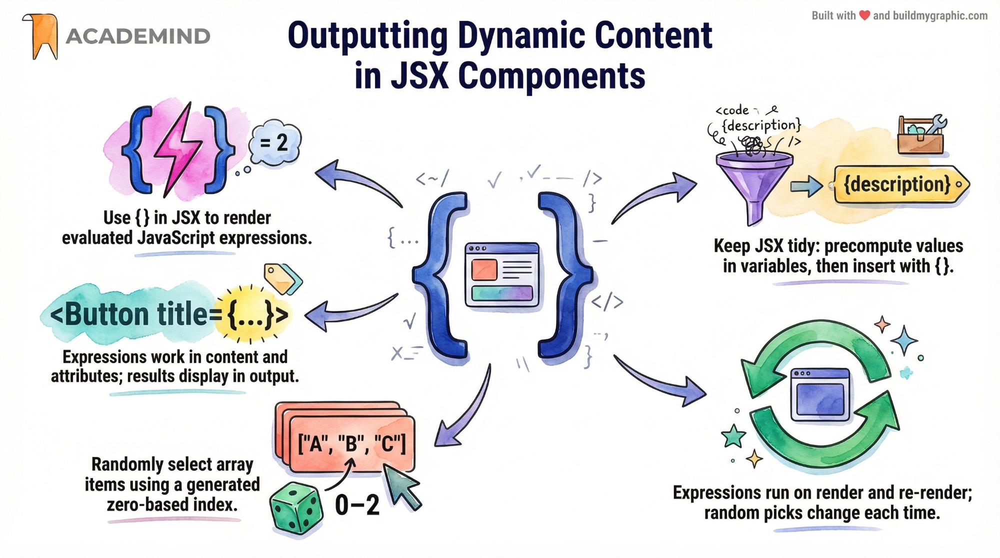

Now that we have built our **first custom React component**, the next crucial step is learning **how to output dynamic content** instead of static text.

This is a **core React concept** that you will use constantly when building real applications.

---

## The Goal

Instead of always displaying the same static text:

> **Fundamental React Concepts**

we want to **randomly switch** between different descriptions, for example:
- Fundamental React Concepts
- Crucial React Concepts
- Core React Concepts

This requires:
- JavaScript logic
- Dynamic rendering in JSX

---

## Preparing Dynamic Data

To achieve this, we first define:
- An array of possible descriptions
- A helper function to generate a random index

Conceptually, the setup looks like this:

```
const reactDescriptions = ['Fundamental', 'Crucial', 'Core'];

function genRandomInt(max) {
  return Math.floor(Math.random() * (max + 1));
}
```

This gives us:
- A fixed list of possible values
- A way to randomly select one of them

---

## Rendering Dynamic Values in JSX

JSX allows you to embed **dynamic JavaScript expressions** using **curly braces**:

```
{ /* JavaScript expression */ }
```

### Important Rules
- You can place curly braces:
  - Between JSX tags
  - Inside attribute values
- Inside the braces, **any valid JavaScript expression** can be used
- Statements (if, for, while) are **not allowed**
- Expressions (calculations, function calls, variables) **are allowed**

---

## Simple Example

```
<p>{1 + 1}</p>
```

This would render:
> **2**

Because the expression is evaluated and its result is rendered.

---

## Using Dynamic Data in the Header Component

Inside the `Header` component, we replace the static text with a dynamic expression:

```
<h1>
  {reactDescriptions[genRandomInt(2)]} React Concepts
</h1>
```

What happens here:
- `genRandomInt(2)` generates a random index (0–2)
- That index is used to access the array
- The selected word is rendered dynamically

Each page reload triggers a **new render**, producing a different word.

---

## Improving Readability (Best Practice)

To keep JSX clean and readable, it’s recommended to move complex expressions **outside** of JSX.

Example:

```
const description = reactDescriptions[genRandomInt(2)];

return (
  <h1>{description} React Concepts</h1>
);
```

### Why This Is Better
- JSX stays clean and readable
- Logic is separated from markup
- Easier to debug and extend later

Both approaches work, but this one is generally preferred.

---

## When Does This Code Run?

This logic runs:
- When the `Header` component is rendered
- Which happens when the page loads (or re-renders)

Each render:
- Executes the component function
- Re-evaluates the JavaScript expressions
- Produces a potentially different result

---

## Key Takeaways

- JSX supports **dynamic values via curly braces**
- Any JavaScript **expression** can be rendered
- Components are **executed as functions**
- Dynamic UI is created by combining JSX with JavaScript logic
- Keeping JSX lean is considered **best practice**

This dynamic rendering mechanism is one of the **most important features in React** and forms the basis for interactive and data-driven user interfaces.

## Loading Images Correctly in React with Dynamic Values


Now that we understand how to **output dynamic values using curly braces in JSX**, we can apply the same mechanism to **load images in a better and safer way**.

---

## The Problem with Static Image Paths

You may currently see images loaded like this:

```

```

This works during development, but it has **important drawbacks**:

- The image path is **hard-coded**
- During **production build and deployment**, files are:
  - Optimized
  - Renamed
  - Bundled
- Images referenced like this can be:
  - Ignored
  - Lost
  - Not optimized

As a result, your image may **disappear after deployment**.

---

## The Recommended Approach: Import Images

Instead of referencing images via a static path, you should **import them into your JavaScript file**.

Example:

```
import reactImg from './assets/react-core-concepts.png';
```

### Why This Works
- This is **not standard JavaScript**
- Normally, JavaScript cannot import images
- But React projects use a **build process**
- The build process:
  - Understands these imports
  - Tracks the image
  - Includes it in the final build
  - Applies optimizations (hashing, compression, caching)

The same mechanism also explains why imports like this work:

```
import './index.css';
```

---

## Using the Imported Image in JSX

Once imported, the image becomes a **JavaScript variable** that contains the final resolved image path.

You can now use it dynamically in JSX:

```

```

### Important Rules for JSX Attributes
- Use **single curly braces**
- Do **not** wrap the value in quotes
- Curly braces tell JSX:
  - “This is JavaScript, not a string”

❌ Incorrect:
```

```

✅ Correct:
```

```

---

## What Actually Happens Under the Hood

- `reactImg` becomes a variable
- That variable points to the final image URL
- JSX injects that value into the `src` attribute
- The browser loads the optimized image

To React, this is just **dynamic data binding**, the same as rendering text.

---

## Result

After saving and reloading:
- The image still appears on the page
- But now it is:
  - Safely tracked by the build system
  - Included in production builds
  - Optimized automatically

---

## Key Takeaways

- Static image paths are **not safe** for production
- Always import images in React components
- JSX curly braces allow dynamic values everywhere:
  - Text
  - Attributes
  - Image sources
- The build process handles:
  - JSX
  - CSS imports
  - Image imports

This approach ensures your React application is **robust, optimized, and deployment-safe**.

# Reusable Components & Props in React

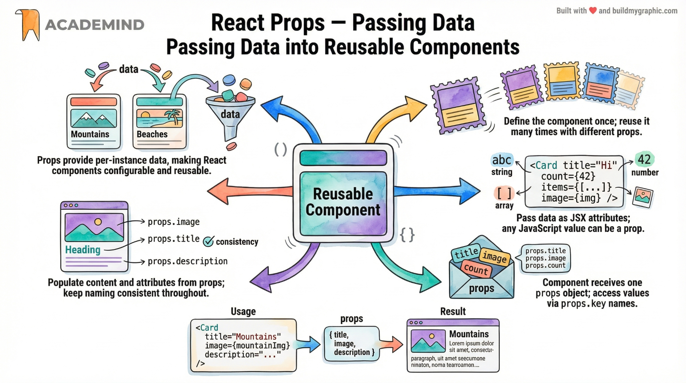

## Why Component Reusability Matters

One of the core strengths of React is **component reusability**.

- Components can be reused multiple times
- Some components are reused only once (e.g. layout components)
- Other components are designed to be reused many times with **different data**

This mirrors standard JavaScript functions:

```js
function greet(name) {
  return `Hello ${name}`;
}

greet("Alice");
greet("Bob");
```

React components follow the same idea — **define once, reuse with different inputs**.

In React, those inputs are called **props**.

---

## What Are Props?

**Props (properties)** are inputs passed from a parent component to a child component.

Key rules:

- Props flow **one-way** (parent → child)
- Props are **read-only**
- Props control **what a component renders**

Mental model:

Component = function(props) → UI

---

## Creating a Reusable Component

Example: a reusable `CoreConcept` component that displays:

- an image
- a title
- a description

```jsx
function CoreConcept(props) {
  return (
    <li>
      
      <h3>{props.title}</h3>
      <p>{props.description}</p>
    </li>
  );
}
```

Important notes:

- Component name starts with an uppercase letter
- The function returns JSX
- `props` is a single object

---

## Passing Props via JSX

Props are passed as **custom JSX attributes**:

```jsx
<CoreConcept
  title="Components"
  description="The core building block of React UIs"
  image={componentsImage}
/>
```

Key points:

- Attribute names are arbitrary (you define them)
- Values can be strings, numbers, arrays, objects, or functions
- Dynamic values use `{}` instead of quotes

---

## How Props Work Internally

This JSX:

```jsx
<CoreConcept title="Components" image={img} />
```

Is conceptually translated by React into:

```js
CoreConcept({
  title: "Components",
  image: img
});
```

Therefore:

- The component receives **one argument**
- That argument is an object containing all props

---

## Using Props Inside JSX

Props are accessed via dot notation:

```jsx
<h3>{props.title}</h3>

<p>{props.description}</p>
```

Important rule:

The prop key used in JSX **must match** the key accessed in the component.

---

## Destructuring Props (Recommended)

Instead of using `props.` everywhere, destructure props:

```jsx
function CoreConcept({ title, description, image }) {
  return (
    <li>
      
      <h3>{title}</h3>
      <p>{description}</p>
    </li>
  );
}
```

Why this is better:

- Cleaner code
- Less repetition
- Easier to read

This is **pure JavaScript destructuring**, not a React feature.

---

## Reusing the Same Component Multiple Times

```jsx
<ul>
  <CoreConcept
    title="Components"
    description="Reusable UI building blocks"
    image={componentsImage}
  />
  <CoreConcept
    title="Props"
    description="Data passed into components"
    image={propsImage}
  />
  <CoreConcept
    title="State"
    description="Data managed inside a component"
    image={stateImage}
  />
</ul>
```

Each component instance:

- Uses the same logic
- Renders different content
- Is fully independent

---

## What Props Are (and Are Not)

Props are:

- Input data
- Configuration
- Read-only

Props are NOT:

- Mutable state
- Internal component memory

Rule of thumb:

If a component **receives** data → props  
If a component **manages** data → state

---

## Key Takeaways

- Components are reusable UI functions
- Props are named inputs passed via JSX
- JSX attributes are bundled into one `props` object
- Components always receive exactly one argument
- Destructuring props is best practice

---

## One-Sentence Summary

Props are named, read-only inputs passed into React components via JSX attributes, bundled into a single object that determines how a component renders its UI.

# Finishing Reusable Components with External Data

## Moving Data Out of Components

To complete the remaining Core Concept items in a clean and scalable way, the data is moved into a **separate file**.

A new file called `data.js` is added next to `App.jsx`.

This file exports an array of objects, where **each object represents one core concept** and contains:

- `image`
- `title`
- `description`

This keeps components focused on **rendering UI**, not storing data.

---

## Example: data.js Structure

Each object represents one concept:

```js
export const CORE_CONCEPTS = [
  {
    image: componentsImg,
    title: "Components",
    description: "The core building block of React UIs."
  },
  {
    image: propsImg,
    title: "Props",
    description: "How components receive input data."
  },
  {
    image: stateImg,
    title: "State",
    description: "Data managed inside components."
  },
  {
    image: jsxImg,
    title: "JSX",
    description: "HTML-like syntax inside JavaScript."
  }
];
```

Key point:

- `CORE_CONCEPTS` is a **named export**

---

## Importing Named Exports Correctly

Because `CORE_CONCEPTS` is a named export, it must be imported with curly braces:

```js
import { CORE_CONCEPTS } from "./data.js";
```

Rule reminder:

- `export default` → import without braces
- `export const X` → import with braces `{ X }`

---

## Using Data with Index Access (Basic Approach)

You can manually access each item by index:

```jsx
<CoreConcept
  title={CORE_CONCEPTS[0].title}
  description={CORE_CONCEPTS[0].description}
  image={CORE_CONCEPTS[0].image}
/>
```

This works and demonstrates:

- Components are reused
- Data changes based on input (props)

But this approach becomes repetitive.

---

## Cleaner Alternative: Spread Operator for Props

If prop names match object property names, you can use the **spread operator**:

```jsx
<CoreConcept {...CORE_CONCEPTS[0]} />
<CoreConcept {...CORE_CONCEPTS[1]} />
<CoreConcept {...CORE_CONCEPTS[2]} />
<CoreConcept {...CORE_CONCEPTS[3]} />
```

What happens here:

- `{...CORE_CONCEPTS[0]}` spreads all key–value pairs
- Each key becomes a separate prop
- Equivalent to passing title, image, description manually

Benefits:

- Less code
- Cleaner JSX
- Easier to maintain

---

## Accepting Props in the Component (Basic)

Classic approach:

```jsx
function CoreConcept(props) {
  return (
    <li>
      
      <h3>{props.title}</h3>
      <p>{props.description}</p>
    </li>
  );
}
```

This is perfectly valid and readable.

---

## Cleaner Component Code with Destructuring

You can destructure props directly in the parameter list:

```jsx
function CoreConcept({ image, title, description }) {
  return (
    <li>
      
      <h3>{title}</h3>
      <p>{description}</p>
    </li>
  );
}
```

What happens:

- JavaScript extracts `image`, `title`, `description` from `props`
- These become local variables
- Less repetition and cleaner JSX

Important:

- Property names **must match** the props being passed

---

## Compatibility of Both Approaches

Destructuring works with:

- Explicit props
- Spread props

Both of these work identically:

```jsx
<CoreConcept title="X" image={img} description="Y" />
<CoreConcept {...someObject} />
```

---

## Key Takeaways

- Move data into separate files for scalability
- Import named exports with curly braces
- Use the spread operator to reduce repetitive props
- Destructure props in component parameters for cleaner code
- One reusable component + dynamic props = powerful UI composition

---

## One-Sentence Summary

By storing UI data in external arrays, spreading objects into props, and destructuring props inside components, React components stay clean, reusable, and easy to scale.

# Advanced Props Patterns in React

This section extends the previous lecture and shows **additional, practical ways of working with props**. All of these are regular JavaScript patterns that React fully embraces.

---

## 1. Passing a Single Object as One Prop

If your data is already grouped in an object, you **don’t have to split it into multiple props**.

### Instead of splitting props

```jsx
<CoreConcept
  title={CORE_CONCEPTS[0].title}
  description={CORE_CONCEPTS[0].description}
  image={CORE_CONCEPTS[0].image}
/>
```

or even:

```jsx
<CoreConcept {...CORE_CONCEPTS[0]} />
```

you can pass **one object as one prop**:

```jsx
<CoreConcept concept={CORE_CONCEPTS[0]} />
```

### Using the object inside the component

```jsx
export default function CoreConcept({ concept }) {
  return (
    <li>
      
      <h3>{concept.title}</h3>
      <p>{concept.description}</p>
    </li>
  );
}
```

You can also destructure the object inside the component:

```js
const { title, description, image } = concept;
```

### When this approach is useful

- Clear component API (`concept` is one meaningful unit)
- Less prop “pollution”
- Good for domain-oriented components

---

## 2. Grouping Multiple Props into One Object (Rest Props)

React components always receive **one props object**, but you can explicitly group incoming props using the **rest operator**.

### Component usage (multiple props)

```jsx
<CoreConcept
  title={CORE_CONCEPTS[0].title}
  description={CORE_CONCEPTS[0].description}
  image={CORE_CONCEPTS[0].image}
/>
```

### Grouping props inside the component

```jsx
export default function CoreConcept({ ...concept }) {
  return (
    <li>
      
      <h3>{concept.title}</h3>
      <p>{concept.description}</p>
    </li>
  );
}
```

What happens here:

- `{ ...concept }` collects **all props** into one object
- `concept` now contains `title`, `description`, `image`

### Why this can be useful

- Forwarding props to other components
- Building wrapper or layout components
- Keeping component signatures flexible

---

## 3. Default Prop Values

Some props are **optional**. For example, a `Button` component might optionally receive a `type`.

### Component usage

With explicit type:

```jsx
<Button type="submit" caption="My Button" />
```

Without type:

```jsx
<Button caption="My Button" />
```

### Setting default values with destructuring

```jsx
export default function Button({ caption, type = "submit" }) {
  return <button type={type}>{caption}</button>;
}
```

What happens:

- If `type` is passed → it’s used
- If `type` is missing → `"submit"` is used automatically

This is **pure JavaScript**, not a React-specific feature.

---

## Mental Model Summary

- **Props are always one object**
- JSX attributes become key–value pairs inside that object
- You choose how to structure and consume them:
  - individual props
  - one grouped object
  - rest/spread patterns
  - default values

---

## One-Sentence Summary

React props are just JavaScript objects, which means you can pass them as single objects, regroup them with rest syntax, or assign default values using destructuring—choose the pattern that best fits your component’s API.

# React Props – Practical Example Explained

This example demonstrates **how props work in React**, how data flows from a **parent component** to a **child component**, and why props are essential for building reusable components.

---

## Code Example (Context)

```jsx
export function CourseGoal(props) {
  return (
    <li>
      <h2>{props.title}</h2>
      <p>{props.description}</p>
    </li>
  );
}

function App() {
  return (
    <div id="app" data-testid="app">
      <h1>Time to Practice</h1>
      <p>One course, many goals! 🎯</p>
      <ul>
        <CourseGoal title={"Learn React"} description={"In-depth"} />
        <CourseGoal title={"Practice"} description={"Practice"} />
      </ul>
    </div>
  );
}

export default App;
```

---

## Component Structure Overview

- **App**  
  The parent (root) component.  
  It defines the data and passes it down.

- **CourseGoal**  
  A child component.  
  It receives data via props and renders UI based on them.

Data flow is **one-directional**:

App → CourseGoal

---

## The `CourseGoal` Component (Child)

```jsx
export function CourseGoal(props) {
  return (
    <li>
      <h2>{props.title}</h2>
      <p>{props.description}</p>
    </li>
  );
}
```

### What This Component Does

- It defines a reusable UI block representing **one course goal**
- It expects **input data** via `props`
- It renders:
  - a title
  - a description

### Understanding `props`

- `props` is **one object**
- React automatically passes it when the component is used
- The object contains:
  - `props.title`
  - `props.description`

Mentally, React does something like:

```js
CourseGoal({
  title: "Learn React",
  description: "In-depth"
});
```

---

## The `App` Component (Parent)

```jsx
<CourseGoal title={"Learn React"} description={"In-depth"} />
<CourseGoal title={"Practice"} description={"Practice"} />
```

### What Happens Here

- The `CourseGoal` component is used **twice**
- Each usage passes **different data**
- JSX attributes become **props**

This means:
- One component
- Multiple configurations
- Zero duplicated markup

---

## Why Props Are Important

Without props:
- You would need separate components for every goal
- Code duplication would increase
- Maintenance becomes harder

With props:
- One reusable component
- Data-driven UI
- Clean separation of concerns

---

## Props Are Named, Not Positional

This is important:

- Props are accessed by **name**, not order
- `title` maps to `props.title`
- `description` maps to `props.description`

Changing the order of attributes does **not** matter.

---

## Common Improvement: Destructuring Props

Instead of:

```jsx
function CourseGoal(props) {
  return <h2>{props.title}</h2>;
}
```

You will often see:

```jsx
function CourseGoal({ title, description }) {
  return (
    <li>
      <h2>{title}</h2>
      <p>{description}</p>
    </li>
  );
}
```

This is **pure JavaScript destructuring** and makes code cleaner.

---

## Mental Model (Key Takeaway)

- JSX attributes → merged into one `props` object
- Component = function that turns `props` into UI
- Props flow **from parent to child**
- Props are **read-only**

---

## One-Sentence Summary

This code shows how React components receive input via props, allowing a single reusable component (`CourseGoal`) to render different content depending on the data passed from its parent (`App`).

# Restructuring React Components into Separate Files

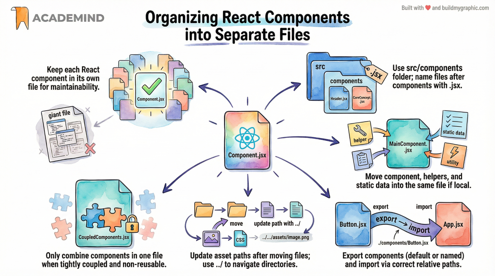

## Why Component Separation Matters

At the moment, all components (`App`, `Header`, `CoreConcept`) live in a single file.  
While this technically works, it **does not scale**.

As a React application grows:
- Files become large and hard to navigate
- Components are harder to locate and maintain
- Collaboration between developers becomes difficult

**Best practice:**  
➡️ Each reusable component should live in its own file.

---

## Recommended Project Structure

A common and widely accepted structure is:

```text
src/
├── components/
│   ├── Header.jsx
│   ├── CoreConcept.jsx
├── assets/
│   ├── react-core-concepts.png
│   ├── components.png
├── App.jsx
├── index.jsx
```

Why this works well:
- `components/` clearly separates UI building blocks
- File names match component names (clear mental mapping)
- Easier imports and refactoring later

---

## Moving the `Header` Component

### 1. Create `Header.jsx`

Inside `src/components/Header.jsx`:

```jsx
import reactImg from "../assets/react-core-concepts.png";

const reactDescriptions = ["Fundamental", "Core", "Crucial"];

function genRandomInt(max) {
  return Math.floor(Math.random() * (max + 1));
}

export default function Header() {
  const description =
    reactDescriptions[genRandomInt(reactDescriptions.length - 1)];

  return (
    <header>
      
      <h1>React Essentials</h1>
      <p>{description} React concepts you will need for almost any app.</p>
    </header>
  );
}
```

### Key Points

- The component is now **self-contained**
- All logic it depends on lives in the same file
- Asset path uses `../` because the file is inside `components/`

---

## Importing `Header` into `App.jsx`

In `App.jsx`:

```jsx
import Header from "./components/Header";
```

Usage stays the same:

```jsx
function App() {
  return (
    <>
      <Header />
      {/* other content */}
    </>
  );
}

export default App;
```

---

## Moving the `CoreConcept` Component

### 1. Create `CoreConcept.jsx`

Inside `src/components/CoreConcept.jsx`:

```jsx
export default function CoreConcept({ image, title, description }) {
  return (
    <li>
      
      <h3>{title}</h3>
      <p>{description}</p>
    </li>
  );
}
```

### Why Destructuring Is Used Here

Instead of:

```js
props.title
props.image
```

We use:

```js
{ image, title, description }
```

Benefits:
- Less repetitive code
- Clearer component API
- Common React convention

---

## Importing `CoreConcept` into `App.jsx`

In `App.jsx`:

```jsx
import CoreConcept from "./components/CoreConcept";
```

Usage example:

```jsx
<CoreConcept
  image={CORE_CONCEPTS[0].image}
  title={CORE_CONCEPTS[0].title}
  description={CORE_CONCEPTS[0].description}
/>
```

Or the cleaner spread syntax:

```jsx
<CoreConcept {...CORE_CONCEPTS[0]} />
```

---

## Why This Is a Best Practice

Separating components into files gives you:

- ✅ Better readability
- ✅ Easier maintenance
- ✅ Cleaner imports
- ✅ Scalable architecture
- ✅ Industry-standard React structure

This is **how real-world React applications are built**.

---

## One-Sentence Summary

Each React component should live in its own file, be exported (usually as default), and imported where needed—this keeps your codebase clean, scalable, and professional.

# Splitting Styles into Component-Specific CSS Files in React

## Why Split CSS Files?

Just like React components, **styles can (and often should) be split** into smaller, more focused files.

Reasons to split CSS:
- Improves readability and maintainability
- Makes it clear which styles belong to which component
- Keeps related files physically close to each other
- Scales better as the project grows

This mirrors the same reasoning behind splitting components into separate files.

---

## Current Situation

Initially:
- All styles live in a single `index.css`
- Styles for `Header`, `CoreConcept`, and other parts are mixed together

This works, but:
- The file grows quickly
- It becomes harder to reason about which styles affect which component

---

## Creating a Component-Specific CSS File

### Example: Header Styles

1. Create a new file next to the component:
   
   **Path:**
   ```
   src/components/header/Header.css
   ```

2. Move all header-related rules from `index.css` into `Header.css`  
   (e.g. rules targeting `header`, `header img`, `header h1`, etc.)

---

## Why Styles “Disappear” After Moving CSS

After removing the header styles from `index.css`, the styling breaks.

This happens because:
- CSS files are **not automatically included**
- They must be explicitly imported into JavaScript files

This is already true for `index.css`, which is imported in `index.jsx`.

---

## Importing CSS in a Component

To re-enable the styles, import the CSS file in the component file itself.

### `Header.jsx`

```jsx
import "./Header.css";
import reactImg from "../../assets/react-core-concepts.png";

export default function Header() {
  return (
    <header>
      
      <h1>React Essentials</h1>
      <p>Core React concepts you will need.</p>
    </header>
  );
}
```

Thanks to the build process:
- This import works
- The CSS is bundled and injected into the page

---

## Important Limitation: CSS Is NOT Scoped

Even though the CSS file is imported inside `Header.jsx`:

- **The styles are still global**
- They apply to *all* matching elements on the page

Example:
```jsx
<header>
  <h1>Hello World</h1>
</header>
```

➡️ This header would also be styled, even if it’s not part of the `Header` component.

**Key takeaway:**  
Importing CSS in a component file does **not** automatically scope it to that component.

---

## Why This Is Still Useful

Despite being global, component-specific CSS files are still valuable because:
- They improve organization
- They make intent clearer
- They reduce cognitive load when editing styles

Later in the course, you’ll learn **CSS scoping solutions** (e.g. CSS Modules).

---

## Optional Folder Refinement

A common refinement is to group all component-related files in a subfolder.

### Example Structure

```
src/
├── components/
│   ├── header/
│   │   ├── Header.jsx
│   │   ├── Header.css
│   ├── CoreConcept.jsx
├── assets/
├── App.jsx
```

Benefits:
- All files for one component live together
- Easy navigation in larger projects

---

## Required Import Path Adjustments

### In `App.jsx`

```jsx
import Header from "./components/header/Header";
```

### In `Header.jsx` (image path update)

```jsx
import reactImg from "../../assets/react-core-concepts.png";
```

Because:
- `Header.jsx` is now two levels deep
- `../../` moves back to `src/`

---

## Final Result

After adjusting imports:
- Styles work exactly as before
- Codebase is cleaner and better structured
- Components and styles are logically grouped

---

## One-Sentence Summary

Splitting CSS into component-specific files improves structure and maintainability, but those styles remain global unless explicit scoping techniques are used.

# Tab Buttons, `children` Prop, and Component Composition in React

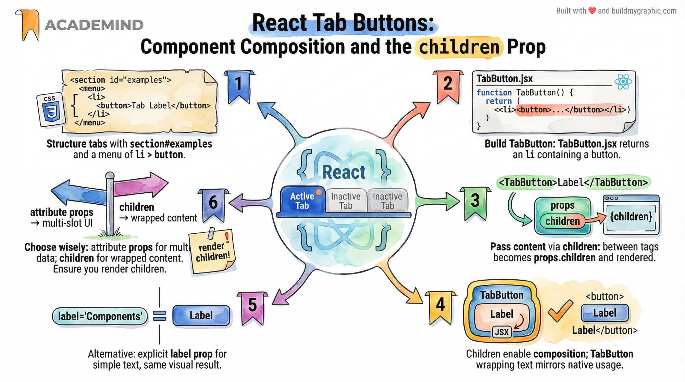

## Goal of This Step

The next major feature of the app is the **interactive tabs section** at the bottom of the page.  
To build this cleanly and in a reusable way, we introduce a **new component** for tab buttons.

This step focuses on:
- Creating a reusable `TabButton` component
- Understanding the special `children` prop
- Learning the concept of **component composition**

---

## Creating the Tabs Section in `App.jsx`

A new section is added below the Core Concepts section:

- The section has an `id="examples"` (required for styling)
- It contains:
  - A heading (`h2`)
  - A `menu` element (semantic HTML for grouped actions)
  - Multiple tab buttons

Conceptually:

```jsx
<section id="examples">
  <h2>Examples</h2>
  <menu>
    <TabButton>Components</TabButton>
    <TabButton>JSX</TabButton>
    <TabButton>Props</TabButton>
    <TabButton>State</TabButton>
  </menu>
</section>
```

---

## Creating the `TabButton` Component

A new file is created:

**Path**
> src/components/TabButton.jsx


Initial version of the component:

```jsx
export default function TabButton() {
  return (
    <li>
      <button></button>
    </li>
  );
}
```

At this point:
- No button text is shown
- Even though text is written between `<TabButton>...</TabButton>` in `App.jsx`

---

## Why the Button Text Is Missing

When you write:

```jsx
<TabButton>Components</TabButton>
```

The text `Components` is **not automatically rendered**.

Reason:
- React does not guess where this content should go
- The component must explicitly render it

This content is passed through a **special built-in prop**.

---

## The Special `children` Prop

Every React component **automatically receives a `children` prop**.

### What is `children`?

- `children` contains everything placed **between the opening and closing tags** of a component
- It can be:
  - Text
  - JSX
  - Other components
  - Any renderable content

Example mapping:

```jsx
<TabButton>Components</TabButton>
```

Internally becomes:

```js
props.children === "Components"
```

---

## Using `children` Inside `TabButton`

### Version using `props.children`

```jsx
export default function TabButton(props) {
  return (
    <li>
      <button>{props.children}</button>
    </li>
  );
}
```

### Cleaner version using destructuring (recommended)

```jsx
export default function TabButton({ children }) {
  return (
    <li>
      <button>{children}</button>
    </li>
  );
}
```

Result:
- The button text now appears correctly
- The button is clickable (though not functional yet)

---

## Component Composition (Key Concept)

This pattern is called **component composition**.

### What is component composition?

- Components **wrap other content or components**
- Instead of configuring everything via attributes (props), you place content *inside* the component

This feels natural because it mirrors HTML:

```html
<button>Components</button>
```

And in React:

```jsx
<TabButton>Components</TabButton>
```

---

## Alternative Approach: Using a Custom Prop (e.g. `label`)

Instead of `children`, you could use an explicit prop:

```jsx
<TabButton label="Components" />
```

And inside the component:

```jsx
export default function TabButton({ label }) {
  return (
    <li>
      <button>{label}</button>
    </li>
  );
}
```

### Comparison

| Approach | When it makes sense |
|--------|---------------------|
| `children` | When the component wraps content (buttons, cards, layouts) |
| Custom prop (`label`) | When the component is more data-driven or strict |

Both approaches are **equally valid**.

---

## Why `children` Is Preferred Here

For `TabButton`, `children` is a good fit because:
- It mirrors native HTML button usage
- It allows flexible content (icons, text, JSX later)
- It improves readability in `App.jsx`

---

## Summary

- `children` is a **built-in React prop**
- It contains content placed between component tags
- Using `children` enables **component composition**
- Composition is ideal for wrapper-style components like buttons, cards, layouts
- Both `children` and explicit props are valid—choice depends on use case

With this in place, the tab buttons are rendered correctly and we are ready to make them interactive in the next step.

# Card Component – Structured Notes (Props & Children)

## 1. Purpose of the Card Component

The `Card` component is a **reusable layout (wrapper) component**.

Its responsibilities are:
- provide a consistent visual container (styling),
- render a title,
- render any nested content passed from the parent component.

This is a textbook example of **component composition** in React.

---

## 2. Final Correct Implementation

### Card.jsx

```jsx
import './Card.css';

export default function Card({ name, children }) {
  return (
    <article className="card">
      <h2>{name}</h2>
      {children}
    </article>
  );
}
```

---

## 3. Explanation of Each Part

### 3.1 Importing Component Styles

```js
import './Card.css';
```

- Uses a relative path.
- The bundler (Vite / Webpack) ensures the CSS is included in the final build.
- Styles are **global**, not scoped to the component.
- For scoped styles, CSS Modules or styled-components would be needed.

---

### 3.2 Component Function Signature

```js
function Card({ name, children })
```

This is **object destructuring** applied directly to `props`.

Equivalent to:

```js
function Card(props) {
  const name = props.name;
  const children = props.children;
}
```

Advantages:
- Less repetitive code
- Clearer component API
- Better readability

---

## 4. Props Used by the Card Component

### 4.1 `name` Prop

- Explicitly passed from the parent component
- Used as the card title

```jsx
<h2>{name}</h2>
```

Example usage:

```jsx
<Card name="Anthony Blake">
```

---

### 4.2 `children` Prop (Special Built-in Prop)

- Automatically provided by React
- Contains everything placed **between the opening and closing tags**

Example:

```jsx
<Card name="Anthony Blake">
  <p>Hello</p>
</Card>
```

Internally, React treats this as:

```js
children = <p>Hello</p>;
```

Rendered via:

```jsx
{children}
```

---

## 5. Component Composition (Key Concept)

This pattern:

```jsx
<Card>
  <p>Content</p>
</Card>
```

is called **component composition**.

Meaning:
- The component does not care what content it wraps
- It only defines *where* the content is rendered

This makes components:
- flexible
- reusable
- layout-oriented

---

## 6. App Component Usage Example

```jsx
function App() {
  return (
    <div id="app">
      <h1>Available Experts</h1>

      <Card name="Anthony Blake">
        <p>
          Blake is a professor of Computer Science at the University of Illinois.
        </p>
        <p>
          <a href="mailto:blake@example.com">Email Anthony</a>
        </p>
      </Card>

      <Card name="Maria Miles">
        <p>
          Maria is a professor of Computer Science at the University of Illinois.
        </p>
        <p>
          <a href="mailto:maria@example.com">Email Maria</a>
        </p>
      </Card>
    </div>
  );
}
```

---

## 7. Why `children` Is Powerful

Using `children` allows you to:
- avoid creating many small props (text1, text2, link, etc.),
- pass complex JSX structures,
- mirror native HTML semantics.

Compare:

Prop-based:
```jsx
<Card text="Hello" link="Email" />
```

Composition-based:
```jsx
<Card>
  <p>Hello</p>
  <a>Email</a>
</Card>
```

The second approach is:
- more expressive
- closer to HTML
- more scalable

---

## 8. Mental Model

Think of the Card component as:

**Card = Layout + Title + Slot for Content**

Or functionally:

**props → UI**

---

## 9. Key Takeaways

- Props are inputs passed from parent to child
- `children` is a special prop provided automatically
- Component composition is fundamental in React
- Wrapper components like Card are extremely common
- Destructuring props improves readability

---

# Handling Click Events in React (TabButton Example)

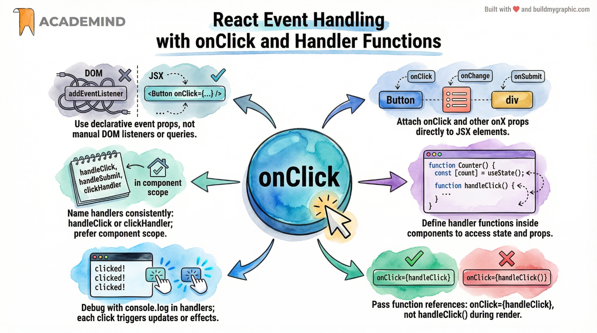

## Goal of This Step

Now that multiple **TabButton** components are rendered, the next goal is to:

- react to user interaction (clicks),
- prepare the ground for showing **different content** based on which button was clicked.

This section introduces **event handling in React**, specifically handling click events.

---

## Event Handling: Vanilla JavaScript vs React

### Vanilla JavaScript (Imperative Approach)

In plain JavaScript, you would typically:

- select a DOM element (e.g. via `querySelector`)
- manually attach an event listener with `addEventListener`
- imperatively manipulate the DOM

This approach is **not recommended in React**.

---

## React Approach: Declarative Event Handling

React follows a **declarative paradigm**:

- You describe **what should happen** when an event occurs.
- React handles **how and when** the DOM interaction happens.

Instead of `addEventListener`, React uses **event props**.

---

## Using Event Props in JSX

### The `onClick` Prop

React provides special props for events, for example:

- `onClick`
- `onChange`
- `onSubmit`
- `onMouseEnter`
- many others

These props can be added to **any JSX element**, including built-in elements like `<button>`, `<li>`, `<div>`, etc.

---

## Example: TabButton Component with Click Handling

### TabButton.jsx

```jsx
export default function TabButton({ children }) {
  function handleClick() {
    console.log('Hello World!');
  }

  return (
    <li>
      <button onClick={handleClick}>
        {children}
      </button>
    </li>
  );
}
```

---

## Key Concepts Explained

### 1. Event Handler Is a Function

The value of `onClick` **must be a function**.

Correct:
```jsx
onClick={handleClick}
```

Incorrect:
```jsx
onClick={handleClick()}
```

Why?

- `handleClick` → passing the function as a value
- `handleClick()` → executing the function immediately during render

React needs the function **reference**, so it can call it later when the click happens.

---

### 2. Why No Parentheses?

When you write:

```jsx
onClick={handleClick}
```

You are saying:

> “React, please call this function when the click event occurs.”

If you wrote:

```jsx
onClick={handleClick()}
```

You would be saying:

> “Call this function now, during rendering, and pass its return value to `onClick`.”

That is **not** what we want.

---

### 3. Defining Functions Inside Components

This is valid JavaScript:

- Functions can be defined inside other functions.
- In React, event handlers are commonly defined **inside component functions**.

Benefits:
- Access to component props and state
- Clear logical grouping
- No global pollution

---

## Why This Fits React’s Philosophy

- No manual DOM querying
- No direct event listeners
- No imperative DOM manipulation

Instead:
- UI declares behavior
- React manages execution timing
- Code stays predictable and maintainable

---

## Result in the Browser

After saving the file:

- Open DevTools (Console)
- Click any TabButton
- You will see `"Hello World!"` logged on every click

This confirms:
- the event handler is correctly attached,
- React executes the function when the event occurs.

---

## What This Enables Next

This is the **first step toward interactivity**.

Next logical steps:
- store which tab was clicked (state),
- conditionally render content based on that state,
- build a fully interactive tab system.

---

# Passing Event Handlers from Parent to Child (TabButton → App)

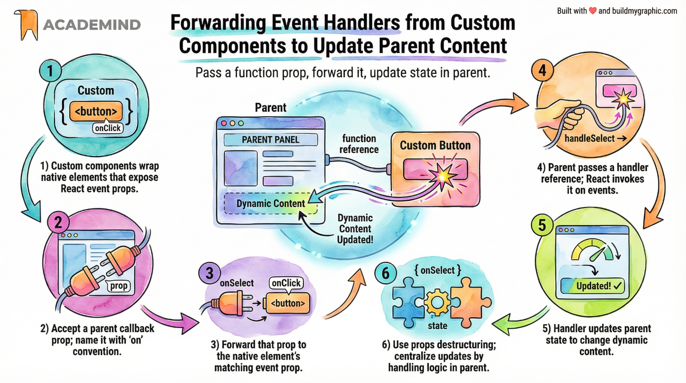

## Goal of This Step

Up to this point, we learned:

- how to listen to events (`onClick`)
- how to execute code when a button is clicked

Now the **real goal** is:

> Change the **dynamic content below the tab buttons** based on which tab was clicked.

This content lives in the **App component**, not inside the `TabButton` component.

Therefore, we must make sure that:
- the click happens in `TabButton`,
- but the **reaction to the click** (logic, state change, rendering) happens in `App`.

---

## Key Idea: Event Handling Must Happen Where the State Lives

- `TabButton` is a **presentational / UI component**
- `App` is the **state-owning component**
- `TabButton` must **notify** `App` when it was clicked
- `App` decides **what to do next**

This is a **fundamental React pattern**.

---

## The Core Pattern: “Pass Functions Down, Call Them Up”

1. **App defines a function** (what should happen when a tab is selected)
2. **App passes that function to TabButton via props**
3. **TabButton forwards that function to a native button’s `onClick`**
4. **React calls the function when the click happens**
5. **App reacts and updates dynamic content**

This is often called:
- *lifting events up*
- *callback props*
- *child → parent communication*

---

## Step 1: TabButton Accepts a Callback Prop

### TabButton.jsx

Instead of handling the click itself, `TabButton` accepts a prop called `onSelect`.

```jsx
export default function TabButton({ children, onSelect }) {
  return (
    <li>
      <button onClick={onSelect}>
        {children}
      </button>
    </li>
  );
}
```

### Important Notes

- `onSelect` is **not special**
- You could name it:
  - `onClick`
  - `onTabClick`
  - `onChoose`
- Naming convention:
  - props that expect functions often start with `on`

Only `children` is special and must be named exactly `children`.

---

## Step 2: App Passes a Function to the Custom Component

### App.jsx (simplified)

```jsx
function App() {
  function handleSelect() {
    console.log('Selected!');
  }

  return (
    <section id="examples">
      <menu>
        <TabButton onSelect={handleSelect}>
          Components
        </TabButton>
        <TabButton onSelect={handleSelect}>
          JSX
        </TabButton>
        <TabButton onSelect={handleSelect}>
          Props
        </TabButton>
      </menu>
    </section>
  );
}
```

---

## What Is Actually Happening Under the Hood?

When React renders this:

```jsx
<TabButton onSelect={handleSelect}>Components</TabButton>
```

It effectively does:

```js
TabButton({
  onSelect: handleSelect,
  children: "Components"
});
```

And inside `TabButton`, this happens:

```jsx
<button onClick={onSelect}>
```

So the chain is:

- click on `<button>`
- React triggers `onClick`
- `onClick` points to `onSelect`
- `onSelect` points to `handleSelect` (from App)
- `handleSelect` runs **inside App**

---

## Why This Pattern Is So Important

### ❌ Wrong Approach

Trying to update content from inside `TabButton`:

- `TabButton` does not own the content
- no access to the JSX below the menu
- breaks React’s data flow model

### ✅ Correct React Approach

- **State and logic live in the parent**
- **Child components notify parent**
- **Parent decides what to render**

This follows React’s core principle:

> **Unidirectional data flow (top → down)**

---

## Why We Didn’t Gain Much *Yet*

At this stage:
- we still only log to the console
- no visible UI change

But now we are **architecturally ready** to:
- store selected tab in state
- conditionally render content
- build a fully interactive tabs section

This setup is **required** before introducing `useState`.

---

## Mental Model (Very Important)

Think of it like this:

- **TabButton**
  - “I was clicked”
- **App**
  - “Okay, I’ll decide what that means”

The child **does not decide behavior**  
The parent **controls behavior and data**

---

## Summary

- Custom components don’t automatically handle events
- You forward event handlers via props
- The parent passes a function
- The child calls it at the right time
- This enables dynamic, controlled UI updates

---

Next step:
➡️ introduce **state** and actually change the content on screen.

## Passing Arguments to Event Handlers in React (Tabs Example)

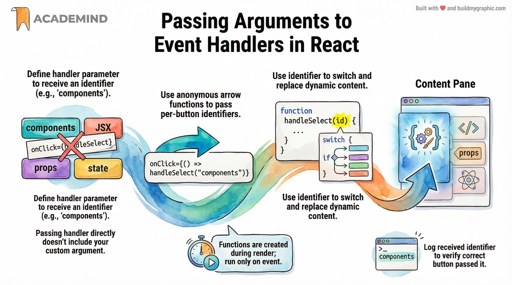

### Goal of This Step

So far, we can:
- listen to click events on **custom components**
- execute a function in the **App component** when a button is clicked

Now we want to **show different content** depending on **which tab button was clicked**.

To do that, we must first answer one question:

> **Which button was clicked?**

---

## Step 1: We Need an Identifier for Each Button

We want our event handler to know *which tab* triggered the click.

A simple and common solution is:
- pass a **string identifier** to the handler

For example:
- `"components"`
- `"jsx"`
- `"props"`
- `"state"`

So our handler function in `App` should accept a parameter:

```js
function handleSelect(selectedButton) {
  console.log(selectedButton);
}
```

This `selectedButton` value will later determine which content is rendered.

---

## Step 2: Why Passing the Function Directly Is Not Enough

If we do this:

```jsx
<TabButton onSelect={handleSelect}>Components</TabButton>
```

Then:
- React will call `handleSelect()` **without arguments**
- React has no idea that we want `"components"` passed in

React only knows:
> “Call this function when the button is clicked”

So we must **control how the function is executed**.

---

## Step 3: Wrapping the Handler in an Arrow Function (Key Pattern)

Instead of passing the function reference directly, we pass **a new function**:

```jsx
<TabButton onSelect={() => handleSelect('components')}>
  Components
</TabButton>
```

### What Changed?

- `onSelect` now receives an **anonymous arrow function**
- This arrow function:
  - does **not execute immediately**
  - executes **only when the click happens**
  - calls `handleSelect()` **with our custom argument**

This is **standard JavaScript**, not React-specific.

---

## Step 4: Why This Works (Execution Timing)

This code:

```jsx
onSelect={() => handleSelect('components')}
```

means:

- React stores the arrow function as the click handler
- nothing runs during render
- when the button is clicked:
  - React executes the arrow function
  - the arrow function calls `handleSelect('components')`

❗ If we wrote this instead:

```jsx
onSelect={handleSelect('components')}
```

Then:
- `handleSelect` would run **immediately during rendering**
- `onSelect` would receive its return value (usually `undefined`)
- ❌ wrong behavior

---

## Step 5: Applying This to All Tab Buttons

```jsx
<TabButton onSelect={() => handleSelect('components')}>
  Components
</TabButton>

<TabButton onSelect={() => handleSelect('jsx')}>
  JSX
</TabButton>

<TabButton onSelect={() => handleSelect('props')}>
  Props
</TabButton>

<TabButton onSelect={() => handleSelect('state')}>
  State
</TabButton>
```

Now:
- each button passes a **different identifier**
- `handleSelect` receives different values
- we can verify this via `console.log`

---

## Step 6: Verifying the Result

```js
function handleSelect(selectedButton) {
  console.log(selectedButton);
}
```

When clicking buttons, the console shows:

- `components`
- `jsx`
- `props`
- `state`

✅ This confirms that:
- the correct identifier is passed
- event handling is wired correctly

---

## Why This Pattern Is Extremely Important

This pattern is used everywhere in React:

- lists
- tabs
- forms
- buttons
- menus
- callbacks with parameters

### General Rule

> If an event handler needs arguments, **wrap it in an arrow function**.

---

## What We Have Achieved So Far

At this point:
- clicks are handled in the **App component**
- we know **which button was clicked**
- we are ready to:
  - store this value in state
  - conditionally render content based on it

---

## What Comes Next

The final missing piece is **state**.

Next step:
- store `selectedButton` in state
- re-render UI when it changes
- replace placeholder content with real dynamic content

This is where React truly becomes powerful.

## Why a Normal Variable Does NOT Update the UI in React

### The Initial Idea (and Why It Seems Reasonable)

At first glance, it looks logical to do the following:

- Define a variable inside the `App` component
- Update that variable when a button is clicked
- Output that variable dynamically in JSX

Example idea (simplified):

```js
let tabContent = 'Please click a button';

function handleSelect(selectedButton) {
  tabContent = selectedButton;
}
```

And then render it:

```jsx
<p>{tabContent}</p>
```

### What We Expect

- Clicking a button updates `tabContent`
- The UI should show the new value

### What Actually Happens

- `handleSelect` **does execute**
- `tabContent` **does change**
- ❌ **The UI does NOT update**

This is not a bug.  
This is **expected React behavior**.

---

## The Core Problem: React Does Not Re-run Components Automatically

React renders UI in **two phases**:

1. **Initial render**
2. **Re-render when React is explicitly told that something changed**

A **regular variable** does **not** tell React anything.

---

## Why the UI Stays the Same

### Key Rule in React

> React executes a component function **only once by default**.

That happens:
- when React first encounters the component in JSX

Example:
- `App` is executed once (from `index.jsx`)
- `TabButton` is executed once per usage (4 times)

After that:
- React does **not** re-run the component
- unless **state changes**

---

## Proof: Logging Component Execution

If you add this inside `App`:

```js
console.log('App Component executing');
```

And this inside `TabButton`:

```js
console.log('TabButton Component executing');
```

### What You Will See

- On page load:
  - `App Component executing` → once
  - `TabButton Component executing` → four times

- On button clicks:
  - ❌ no new component logs
  - ✅ only event handler logs

This proves:
- components are **not re-executed**
- event handlers **do not trigger re-renders**

---

## Why Updating a Variable Is Not Enough

React renders UI based on **JSX output**.

JSX is evaluated **only when the component function runs**.

If the function does not run again:
- JSX is not re-evaluated
- React sees no changes
- DOM is not updated

Changing a variable does **not**:
- notify React
- trigger a re-render
- update JSX

---

## The Missing Concept: State

What we actually need is a way to:

- store data **inside a component**
- tell React **“this data changed”**
- force React to **re-execute the component**
- update the UI automatically

That mechanism is called:

## 👉 **State**

State is:
- reactive
- managed by React
- the trigger for re-rendering components

---

## Mental Model (Very Important)

| Concept | Effect |
|------|------|
| Regular variable | Changes data only |
| Event handler | Runs logic only |
| JSX | Static snapshot |
| **State** | Re-renders component |

---

## Why React Works This Way (Design Reason)

React is:
- declarative
- predictable
- optimized for performance

If React re-rendered on every variable change:
- performance would suffer
- behavior would be unpredictable

So React re-renders **only when explicitly instructed**.

---

## Final Conclusion

- Regular variables **cannot drive UI updates**
- Event handlers **do not cause re-renders**
- Components **run once unless state changes**
- To update UI, we must use **state**

---

## What Comes Next

Next step:
- introduce `useState`
- store selected tab in state
- trigger re-render on button click
- finally show dynamic tab content

This is the **most important concept in React**.

# React State with useState – Making the UI Truly Dynamic

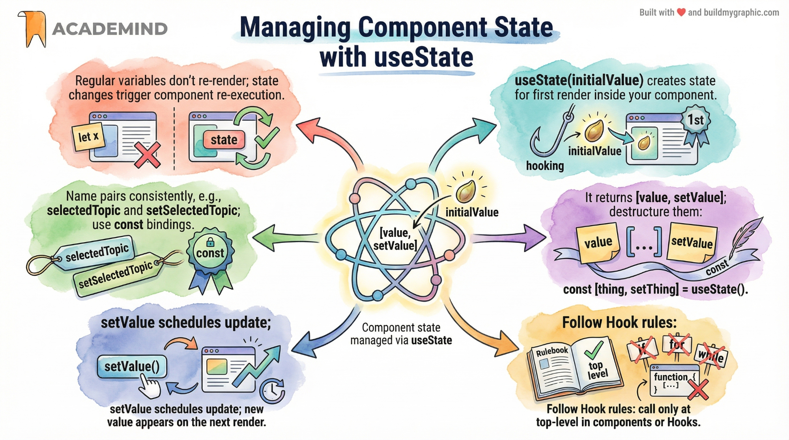

## Why We Need State

Previously, we tried to update the UI by changing a **regular variable**.  
That failed because:

- React executes a component function **only once by default**
- Updating a normal variable does **not** trigger a re-render
- The JSX is therefore **not re-evaluated**

To tell React *“something changed, please update the UI”*, we need **state**.

---

## What Is State in React?

**State** is data that:

- Is **managed by React**
- Belongs to a **specific component**
- When updated, **forces React to re-run the component**
- Automatically updates the UI

State is created and managed via **React Hooks**.

---

## Introducing the useState Hook

`useState` is one of the most important React Hooks.

### Key facts about Hooks

- Hooks are functions whose names start with `use`
- They must be called:
  - Only inside **React component functions**
  - Only at the **top level** (not inside loops, if-statements, or nested functions)

---

## Importing useState

Before using state, you must import it from React:

```js
import { useState } from 'react';
```

---

## Creating State with useState

Inside a component function (e.g. `App`):

```js
const [selectedTopic, setSelectedTopic] = useState('Please click a button');
```

### What this does

- `useState(...)` is called with an **initial value**
- It returns an **array with exactly two elements**

We use **array destructuring** to extract them.

---

## Understanding the Two Returned Values

### 1) selectedTopic (state snapshot)

- Holds the **current state value**
- Used for rendering JSX
- Updated only after a re-render

### 2) setSelectedTopic (state updater function)

- A function provided by React
- Used to update the state
- **Triggers a re-render** of the component

Naming convention:
- State value: `something`
- Setter function: `setSomething`

This convention is not required, but **strongly recommended**.

---

## Updating State in an Event Handler

Instead of modifying a variable, we now call the setter:

```js
function handleSelect(selectedButton) {
  setSelectedTopic(selectedButton);
}
```

Important:
- We do **not** assign directly to `selectedTopic`
- We always use the setter function

---

## Rendering State in JSX

We can now safely output the state value:

```jsx
<p>{selectedTopic}</p>
```

Because this is state:
- React re-runs the component
- JSX is re-evaluated
- The UI updates automatically

---

## Why const Works with State

Even though we use `const`:

- The variable is **recreated on every render**
- React stores the actual value internally
- On the next render, React injects the updated value

So `const` is not a problem at all.

---

## Important Behavior: State Updates Are Asynchronous

If you do this:

```js
function handleSelect(selectedButton) {
  setSelectedTopic(selectedButton);
  console.log(selectedTopic);
}
```

You will see the **old value** in the console.

### Why?

- `setSelectedTopic` does **not update immediately**
- React **schedules** the update
- The new value becomes available **after the next render**

Mental model:
> Calling a state setter schedules a re-render — it does not update the value instantly.

---

## Proof: Component Re-Execution

If you add:

```js
console.log('App component executing');
```

You will observe:

- Logged once on initial load
- Logged again **every time state changes**

This confirms:
- State updates cause re-renders
- Re-renders re-execute the component function

---

## Final Mental Model

- Components are functions
- JSX is a snapshot of state at render time
- State changes → re-render → new JSX → updated DOM

---

## Key Takeaways

- Regular variables cannot update the UI
- State is React’s mechanism for dynamic data
- `useState`:
  - stores data
  - provides a setter
  - triggers re-renders
- State updates are asynchronous
- This is the foundation of **interactive React apps**

---

## What Comes Next

Now that state works:
- We can map selected topics to real content
- Conditionally render JSX
- Build fully interactive tabs

This is the turning point where React becomes powerful.

# Using State to Render Dynamic Tab Content

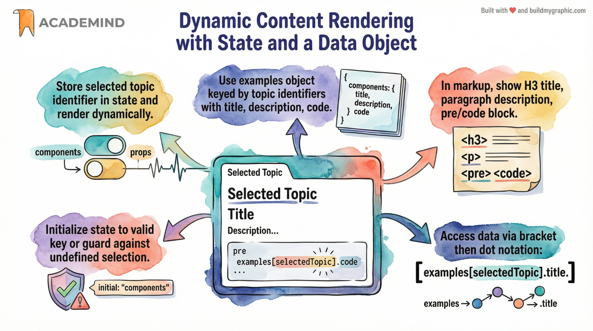

## Goal of This Step

Until now, clicking a tab button only changed a **string identifier** (e.g. `"components"`, `"jsx"`).  
Now we want to use that identifier to render **real content**:

- A title
- A description
- A code example

All dynamically, based on which tab is selected.

---

## Data Source: `examples` Object

The updated `data.js` file exports a new constant:

- `examples` is an **object**
- Its keys match the tab identifiers:
  - `components`
  - `jsx`
  - `props`
  - `state`
- Each key points to an object with:
  - `title`
  - `description`
  - `code`

Conceptually:

```js
examples = {
  components: { title, description, code },
  jsx: { title, description, code },
  props: { title, description, code },
  state: { title, description, code }
}
```

This structure is critical:  
**state value === object key**

---

## Importing the Data

Because state is managed in `App.jsx`, that’s where we import `examples`:

```js
import { examples } from './data.js';
```

---

## Rendering Area for Dynamic Content

We add a dedicated container for tab-specific content:

- A wrapping `div` with `id="tab-content"` (for styling)
- Inside:
  - `h3` → title
  - `p` → description
  - `pre > code` → code example

Structure:

```jsx
<div id="tab-content">
  <h3>...</h3>
  <p>...</p>
  <pre>
    <code>...</code>
  </pre>
</div>
```

---

## Dynamic Property Access (Key Concept)

We already store the selected tab in state:

```js
const [selectedTopic, setSelectedTopic] = useState('components');
```

Now we use **bracket notation** to access the correct entry:

```js
examples[selectedTopic]
```

This is standard JavaScript:

- Dot notation: `obj.prop` → static
- Bracket notation: `obj[variable]` → dynamic

---

## Rendering the Dynamic Content

Using JSX expressions:

```jsx
<h3>{examples[selectedTopic].title}</h3>
<p>{examples[selectedTopic].description}</p>
<pre>
  <code>{examples[selectedTopic].code}</code>
</pre>
```

What happens here:

1. `selectedTopic` changes via state
2. Component re-renders
3. React re-evaluates JSX
4. Correct object is read from `examples`
5. UI updates automatically

---

## Important Edge Case: Initial State

### The Problem

Originally, the initial state was:

```js
useState('Please click a button');
```

But then React tried to do:

```js
examples['Please click a button']
```

That key does **not exist**, causing a runtime error.

---

## Temporary Fix (for Now)

We set a valid default key:

```js
useState('components');
```

This guarantees:

- The key exists in `examples`
- The UI renders valid content immediately

Later, this can be improved with:
- Conditional rendering
- Fallback UI

---

## Resulting Behavior

- Initial render shows **Components** content
- Clicking:
  - JSX → shows JSX example
  - Props → shows Props example
  - State → shows State example
- No page reload
- No manual DOM updates
- Fully declarative and state-driven

---

## Core Concepts Reinforced Here

- State controls **what** is rendered
- Objects + dynamic keys are ideal for tab-based UIs
- React re-renders based on **state changes**, not variables
- JSX expressions can contain **any valid JavaScript expression**

---

## Mental Model

State value → key → data object → JSX → UI

This pattern is extremely common in real React applications.

---

## Next Logical Improvements

- Handle “no selection” gracefully
- Highlight the active tab
- Extract tab content into a separate component

But functionally, this is already a **complete dynamic tab system**.

# Conditional Rendering in React

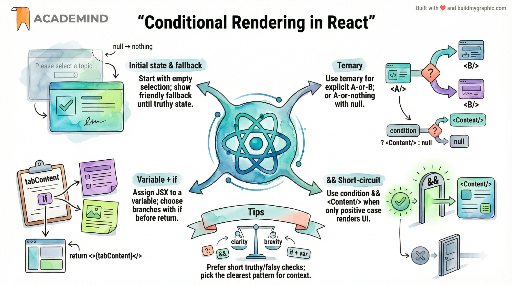

## Why Conditional Rendering Is Needed

At the moment, we can render tab-specific content based on the selected button.  
However, we **don’t want to show any tab content initially**.

Instead of showing `"Components"` by default, we want to show a fallback message:

> **"Please select a topic."**

This means:
- If **no topic is selected** → show fallback text
- If **a topic is selected** → show tab content

This pattern is extremely common in React.

---

## Problem Recap

If the initial state is:

```js
const [selectedTopic, setSelectedTopic] = useState();
```

Then this code breaks:

```js
examples[selectedTopic]
```

Because:
- `selectedTopic` is `undefined`
- `examples[undefined]` does not exist

👉 We must **conditionally render** the content.

---

## Conditional Rendering – Three Common Approaches

React does **not** introduce new syntax here.  
All approaches use **plain JavaScript expressions** inside JSX.

---

## 1️⃣ Ternary Operator (`? :`)

### Syntax Reminder

```js
condition ? valueIfTrue : valueIfFalse
```

### Example in React

```jsx
{!selectedTopic
  ? <p>Please select a topic.</p>
  : (
      <div id="tab-content">
        <h3>{examples[selectedTopic].title}</h3>
        <p>{examples[selectedTopic].description}</p>
        <pre>
          <code>{examples[selectedTopic].code}</code>
        </pre>
      </div>
    )
}
```

### Meaning

- If **no topic is selected** → show paragraph
- Otherwise → show full tab content

---

## 2️⃣ Logical AND Operator (`&&`)

This is a **very common React pattern**.

### JavaScript Trick Explained

In JavaScript:

```js
true && "Hello"   // returns "Hello"
false && "Hello"  // returns false
```

React renders:
- JSX → visible output
- `false`, `null`, `undefined` → nothing

### Example in React

```jsx
{!selectedTopic && <p>Please select a topic.</p>}

{selectedTopic && (
  <div id="tab-content">
    <h3>{examples[selectedTopic].title}</h3>
    <p>{examples[selectedTopic].description}</p>
    <pre>
      <code>{examples[selectedTopic].code}</code>
    </pre>
  </div>
)}
```

### Meaning

- If condition is **true**, JSX after `&&` is rendered
- If condition is **false**, nothing is rendered

### Why This Is Popular

- Shorter than ternary
- Very readable
- No explicit `else` needed

---

## 3️⃣ Using a Variable (Cleanest JSX)

This approach keeps JSX very clean.

### Step 1: Prepare JSX in JavaScript

```js
let tabContent = <p>Please select a topic.</p>;

if (selectedTopic) {
  tabContent = (
    <div id="tab-content">
      <h3>{examples[selectedTopic].title}</h3>
      <p>{examples[selectedTopic].description}</p>
      <pre>
        <code>{examples[selectedTopic].code}</code>
      </pre>
    </div>
  );
}
```

### Step 2: Render the Variable

```jsx
{tabContent}
```

### Why This Is Often the Best Choice

- JSX stays minimal
- Complex logic stays in JavaScript
- Easy to read and debug

---

## What Do `!` and `?` Mean?

### `!` (Logical NOT)

```js
!value
```

- Converts value to boolean
- Negates it

Examples:

```js
!true        // false
!false       // true
!undefined   // true
!null        // true
!"text"      // false
!""          // true
```

In our case:

```js
!selectedTopic
```

Means:
> “No topic is selected yet”

---

### `? :` (Ternary Operator)

```js
condition ? A : B
```

- If condition is `true` → return `A`
- If condition is `false` → return `B`

React allows JSX on both sides.

---

## Choosing the Right Approach

| Approach | When to Use |
|--------|-------------|
| Ternary | Simple if/else rendering |
| `&&` | Render something only if condition is true |
| Variable | Complex logic or large JSX blocks |

All three are **100% valid** and widely used.

---

## Key Takeaways

- React does **not** auto-handle missing data
- Conditional rendering is essential
- JSX supports **any JavaScript expression**
- `!`, `&&`, and `? :` are core tools
- Choose readability over cleverness

---

## Mental Model

> **State decides what exists in the UI**

If state changes → React re-renders → conditions re-evaluate → UI updates automatically.

This is the foundation of dynamic React apps.

## Logical NOT (`!`) in JavaScript — Clear and Practical Explanation

### Basic Rule

```js
!value
```

means:

> “Convert `value` to a boolean and return its opposite.”

### Formal Definition

```js
!value === !(Boolean(value))
```

---

## What Happens in Common Cases

### 1️⃣ `value` is defined and **truthy**

```js
const value = 123;
!value; // false

const value = "hello";
!value; // false
```

✔ Yes — it returns `false`.

Why?
- `Boolean(123)` → `true`
- `!true` → `false`

---

### 2️⃣ `value` is `undefined`

```js
const value = undefined;
!value; // true
```

✔ Yes — it returns `true`.

Why?
- `Boolean(undefined)` → `false`
- `!false` → `true`

---

## ⚠ Important: It’s NOT Only About `undefined`

JavaScript has a concept called **falsy values**.

These values behave the same way in boolean contexts.

---

## Falsy Values (Must Know)

All of these evaluate to `false` when converted to boolean:

- `false`
- `0`
- `-0`
- `0n`
- `""` (empty string)
- `null`
- `undefined`
- `NaN`

For **all** of these:

```js
!value === true
```

---

## Practical Truth Table (Quick Reference)

| value        | Boolean(value) | !value |
|-------------|----------------|--------|
| `"text"`    | true           | false  |
| `42`        | true           | false  |
| `{}`        | true           | false  |
| `[]`        | true           | false  |
| `0`         | false          | true   |
| `""`        | false          | true   |
| `null`      | false          | true   |
| `undefined` | false          | true   |
| `NaN`       | false          | true   |

---

## Why This Matters in React

When you write:

```jsx
{!selectedTopic && <p>Please select a topic.</p>}
```

You are **not checking only for `undefined`**.

You are checking:

> “Is `selectedTopic` falsy?”

Which includes:
- `undefined`
- `null`
- `""`
- `0`

This is usually **exactly what you want** in UI logic.

---

## Mental Model (Very Important)

> `!value` does NOT mean  
> “value is undefined”  
>
> It means  
> **“value is falsy”**

This distinction prevents many subtle bugs in React and JavaScript.

---

## Key Takeaway

- `!` is a **boolean negation operator**
- It always converts to boolean first
- It works on **truthy vs falsy**, not just `undefined`
- In React, this makes conditional rendering concise and powerful

Understanding this deeply is a **core JavaScript skill**, not just a React detail.

## Example: Conditional Rendering with `useState` (Delete / Proceed Flow)

This example demonstrates a **very common React UI pattern**:

- Show a **Delete** button by default
- After clicking **Delete**, show a confirmation alert
- After clicking **Proceed**, return back to the **Delete** button

The solution uses **boolean state** and **conditional rendering**.

---

## Goal (Behavior Specification)

1. Initial state  
   → only **Delete** button is visible

2. Click **Delete**  
   → confirmation alert appears

3. Click **Proceed**  
   → alert disappears, **Delete** button appears again

This is a perfect use case for a **boolean state flag**.

---

## Core Idea

- We store UI state in React using `useState`
- A single boolean (`showAlert`) controls **what is rendered**
- No DOM manipulation
- No imperative logic
- Pure declarative React

---

## Final Implementation (Idiomatic React)

```jsx
import React from 'react';

export default function App() {
  const [showAlert, setShowAlert] = React.useState(false);

  return (
    <div>
      {!showAlert && (
        <button onClick={() => setShowAlert(true)}>
          Delete
        </button>
      )}

      {showAlert && (
        <div data-testid="alert" id="alert">
          <h2>Are you sure?</h2>
          <p>These changes can't be reverted!</p>
          <button onClick={() => setShowAlert(false)}>
            Proceed
          </button>
        </div>
      )}
    </div>
  );
}
```

---

## Step-by-Step Explanation

### 1. State Definition

```js
const [showAlert, setShowAlert] = React.useState(false);
```

- `showAlert`  
  → current UI state (boolean)

- `setShowAlert`  
  → function to update state and trigger re-render

- Initial value: `false`  
  → alert is hidden, Delete button is shown

---

## 2. Conditional Rendering: Delete Button

```jsx
{!showAlert && (
  <button onClick={() => setShowAlert(true)}>
    Delete
  </button>
)}
```

Meaning:

- `!showAlert` is `true` → show **Delete**
- Clicking the button sets `showAlert` to `true`
- React re-renders the component

---

## 3. Conditional Rendering: Alert Box

```jsx
{showAlert && (
  <div id="alert">
    <h2>Are you sure?</h2>
    <p>These changes can't be reverted!</p>
    <button onClick={() => setShowAlert(false)}>
      Proceed
    </button>
  </div>
)}
```

Meaning:

- `showAlert === true` → show alert UI
- Clicking **Proceed** sets `showAlert` back to `false`
- React re-renders → Delete button appears again

---

## Why This Works (Mental Model)

React logic here is:

> **State → JSX → UI**

You are not:
- hiding elements manually
- querying the DOM
- toggling CSS classes imperatively

Instead:
- UI is a **pure function of state**
- When state changes, React re-runs the component
- JSX conditions decide what appears

---

## Why `!showAlert` and `showAlert` Are Used

- `!showAlert`  
  → render something when alert is NOT active

- `showAlert`  
  → render something when alert IS active

This ensures:
- only **one UI branch** is visible at a time
- no conflicting states

---

## Why This Is the Correct Pattern

✅ Uses `useState` correctly  
✅ Boolean state for binary UI  
✅ Declarative rendering  
✅ No side effects  
✅ Easy to extend (e.g. Cancel button, animations)

---

## Common Extensions

You could easily add:

- **Cancel** button
- Animations
- Multiple alerts
- Extract alert into a reusable component

The state logic would remain the same.

---

## Key Takeaway

> If clicking a button should change what the user sees,  
> **you need state** — not variables, not DOM logic.

This example is a textbook use of:
- `useState`
- conditional rendering
- event handling in React

Once this pattern clicks, **most React UI problems become trivial**.

## Dynamic Styling in React: Highlighting the Selected Tab

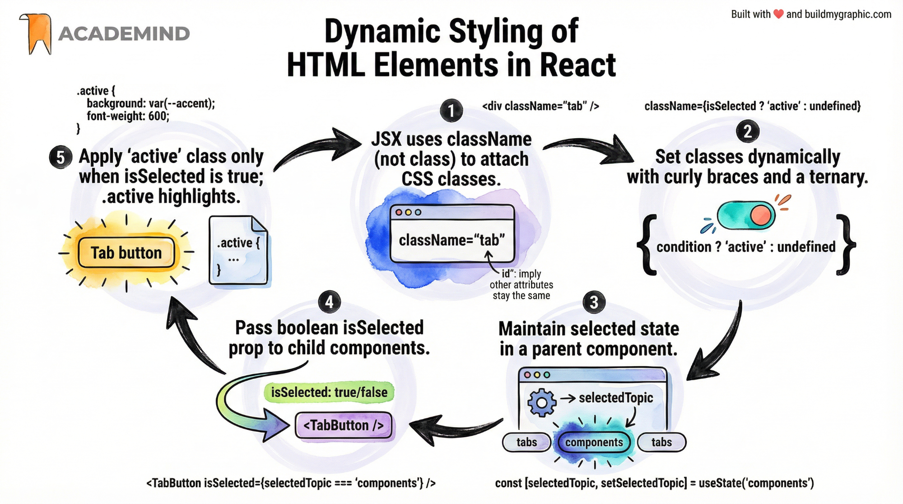

Now that we know how to **render content conditionally**, the next important step is **styling**, and especially **dynamic styling**.

In this example, the goal is simple:

- When a tab is selected → it should be visually highlighted
- When it is not selected → it should look normal

This is achieved by **conditionally setting a CSS class** based on React state.

---

## Key Concept: `className` in JSX

In **regular HTML**, you use:

```html
class="active"
```

In **JSX**, you must use:

```jsx
className="active"
```

This is because `class` is a reserved keyword in JavaScript.

---

## CSS Preparation

In `index.css`, an `.active` class already exists:

```css
.active {
  background-color: #222;
  color: white;
}
```

Our task is to **apply this class only to the currently selected tab**.

---

## Strategy Overview

1. Track which tab is selected using React state (`selectedTopic`)
2. Pass a boolean prop (`isSelected`) to each `TabButton`
3. Use that prop to dynamically set `className`

---

## TabButton Component (Dynamic Styling)

### Updated `TabButton.jsx`

```jsx
export default function TabButton({ children, onSelect, isSelected }) {
  return (
    <li>
      <button
        className={isSelected ? 'active' : ''}
        onClick={onSelect}
      >
        {children}
      </button>
    </li>
  );
}
```

---

## Explanation

### `isSelected` Prop

- `isSelected` is a **boolean**
- `true` → this tab is currently active
- `false` → this tab is inactive

### Dynamic `className`

```jsx
className={isSelected ? 'active' : ''}
```

This means:

- If `isSelected === true` → apply class `active`
- Otherwise → apply no class

This is **conditional attribute rendering**, not conditional content rendering.

---

## Passing `isSelected` from App Component

The `App` component owns the state (`selectedTopic`), so it decides which tab is selected.

### Example in `App.jsx`

```jsx
<TabButton
  onSelect={() => handleSelect('components')}
  isSelected={selectedTopic === 'components'}
>
  Components
</TabButton>

<TabButton
  onSelect={() => handleSelect('jsx')}
  isSelected={selectedTopic === 'jsx'}
>
  JSX
</TabButton>

<TabButton
  onSelect={() => handleSelect('props')}
  isSelected={selectedTopic === 'props'}
>
  Props
</TabButton>

<TabButton
  onSelect={() => handleSelect('state')}
  isSelected={selectedTopic === 'state'}
>
  State
</TabButton>
```

---

## Why This Works

- `selectedTopic` is stored in React state
- When a button is clicked:
  - state updates
  - `App` re-renders
  - each `TabButton` gets a new `isSelected` value
- React updates the DOM efficiently
- Only the correct button gets the `active` class

---

## Important Patterns Demonstrated

### Single Source of Truth
- The selected tab is stored **once** (in state)
- No duplicated logic

### Declarative Styling
- UI is a function of state
- No manual DOM manipulation
- No class toggling via JavaScript

### Reusable Component Design
- `TabButton` does not care *which* tab it is
- It only reacts to props

---

## Alternative Syntax (Short-Circuit)

Instead of a ternary, this also works:

```jsx
className={isSelected && 'active'}
```

But note:
- This sets `className` to `false` when not selected
- Usually safe, but the ternary is clearer for beginners

---

## Key Takeaway

> **Dynamic styling in React is just conditional logic + state.**

If something should *look different* based on user interaction:
- Store that condition in state
- Derive `className` from that state

This pattern is fundamental and appears everywhere in real-world React applications.

## Rendering Lists Dynamically in React (Using `map()`)

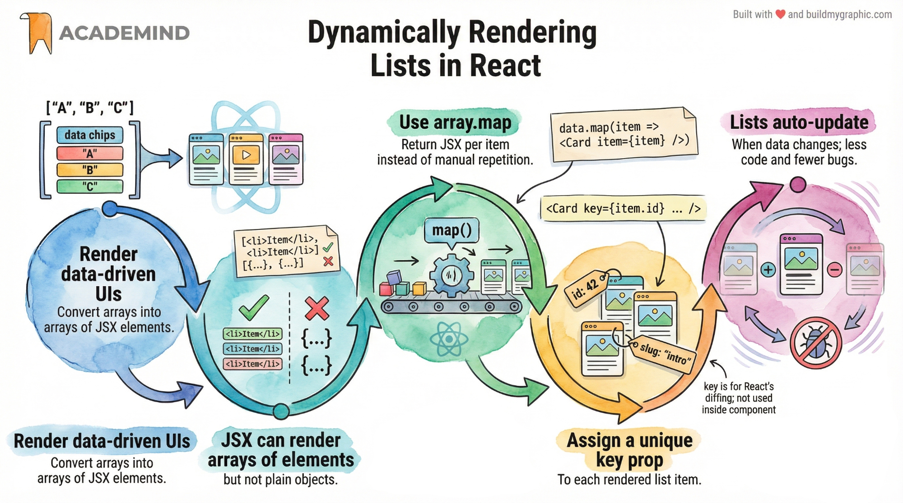

At this point, the demo application is functionally complete, but there is **one important improvement** we should make in the codebase.

The issue is not visual — it is **architectural and maintainability-related**.

---

## The Problem: Manual Repetition of Components

In the `App` component, multiple `CoreConcept` components are rendered manually:

- The same component is repeated several times
- Each instance accesses data by a hard-coded index
- The UI structure is tightly coupled to the data structure

### Why this is a problem

1. **Unnecessary repetition**
   - Writing the same JSX multiple times is verbose and error-prone

2. **Fragile code**
   - If one item is removed from the data array, the UI breaks
   - The component count is not derived from the data

3. **Poor scalability**
   - Adding or removing items requires editing the JSX manually

In React, this is considered an **anti-pattern**.

---

## Key Insight: JSX Can Render Arrays

JSX is capable of rendering **arrays of renderable values**, for example:

- Arrays of strings
- Arrays of JSX elements

Example:

```jsx
['Hello', 'World']
```

or:

```jsx
[
  <p>Hello</p>,
  <p>World</p>
]
```

However, JSX **cannot render raw JavaScript objects** directly.  
Objects must first be transformed into JSX.

---

## The Solution: Transform Data with `map()`

To render a list dynamically, we:

1. Start with an array of data objects
2. Transform each object into JSX
3. Let React render the resulting array

This is done using JavaScript’s built-in `map()` method.

---

## Using `map()` to Generate Components

The `map()` method:

- Iterates over an array
- Executes a function once per item
- Returns a **new array**

In React, that new array is typically **an array of JSX elements**.

### Basic Pattern

```jsx
array.map(item => {
  return <Component />;
})
```

---

## Applying This to `CoreConcepts`

Instead of manually rendering each component, we dynamically generate them from the data array.

### Before (manual, fragile)

- One component per hard-coded index
- UI breaks if data changes

### After (dynamic, robust)

```jsx
<ul>
  {CORE_CONCEPTS.map((concept) => (
    <CoreConcept
      key={concept.title}
      {...concept}
    />
  ))}
</ul>
```

---

## What’s Happening Here

### 1. `CORE_CONCEPTS.map(...)`

- Iterates over every object in the array
- Executes once per item

### 2. `concept` parameter

- Represents the **current object**
- Contains `title`, `description`, `image`, etc.

### 3. `<CoreConcept {...concept} />`

- Uses the **spread operator**
- Converts object properties into props
- Equivalent to:

```jsx
<CoreConcept
  title={concept.title}
  description={concept.description}
  image={concept.image}
/>
```

---

## Why This Is the Correct Pattern in React

This approach ensures that:

- The number of components always matches the data
- Adding or removing data automatically updates the UI
- The code is shorter, cleaner, and safer

This is the **standard React pattern** for rendering lists.

---

## Important Requirement: The `key` Prop

When rendering lists, React requires a special prop called `key`.

### Why `key` Is Required

- React uses `key` internally to track list items
- It enables efficient re-rendering and diffing
- Without it, React shows a warning

### Rules for `key`

- Must be **unique per list item**
- Must be **stable** (not array index, if possible)
- Not accessible via `props` inside the component

### Correct Usage

```jsx
<CoreConcept
  key={concept.title}
  {...concept}
/>
```

Here, `title` is unique across items, making it a good key.

---

## Important Notes About `key`

- `key` is **not** a regular prop
- It cannot be accessed inside `CoreConcept`
- It is used exclusively by React

---

## Summary: Dynamic List Rendering in React

### Core Principles

- JSX can render arrays of JSX elements
- Data should drive the UI, not the other way around
- Lists are rendered using `map()`
- Every list item **must** have a unique `key`

### Mental Model

> **Data → map() → JSX → UI**

This pattern is fundamental in React and will appear throughout real-world applications.

Once you understand this, you understand how React scales.

# React Essentials — Section Summary

This section concludes the **React Essentials** module.  
During this part of the course, we built a complete **interactive demo web application** and, in doing so, covered all **core React fundamentals** that are required to build real-world applications.

Below is a structured recap of what was learned and why it matters.

---

## 1. Components — The Core of React

- React is fundamentally **component-based**
- A component is simply a **JavaScript function** that:
  - Starts with an **uppercase letter**
  - Returns **renderable output** (typically JSX)

### Key rules
- Components are functions
- Component names must start with an uppercase character
- Components return JSX (or another renderable value)

### Usage
Components can be used in JSX just like custom HTML elements:

```jsx
<Header />
<CoreConcept />
<TabButton />
```

This allows complex UIs to be composed from small, reusable building blocks.

---

## 2. JSX — HTML Inside JavaScript

- JSX is a **syntax extension** for JavaScript
- It allows you to write HTML-like markup inside JS code
- JSX must return a **single root element**
- Dynamic values are injected with `{}`

### Dynamic output
- Between tags
- Inside attributes

```jsx
<h2>{title}</h2>

```

---

## 3. Props — Configuring Components

Props allow components to be **reusable and configurable**.

### Core ideas
- Props are passed **from parent to child**
- Props are **read-only**
- All props are collected into a single object

```jsx
<CoreConcept title="Components" description="Reusable UI blocks" />
```

Inside the component:

```jsx
function CoreConcept(props) {
  return <h3>{props.title}</h3>;
}
```

### Destructuring props (recommended)

```jsx
function CoreConcept({ title, description, image }) {
  return <h3>{title}</h3>;
}
```

---

## 4. The Special `children` Prop (Component Composition)

- `children` is automatically provided by React
- It contains the content placed **between opening and closing tags**

```jsx
<Card>
  <p>Hello</p>
</Card>
```

Inside the component:

```jsx
function Card({ children }) {
  return <div>{children}</div>;
}
```

This enables **component composition**, a powerful design pattern in React.

---

## 5. Handling Events (Declarative Approach)

React uses a **declarative event system**.

### Event props
- Built-in elements use `onClick`, `onChange`, etc.
- Values must be **functions**, not function calls

```jsx
<button onClick={handleClick}>Click</button>
```

### Forwarding events via custom props

```jsx
<TabButton onSelect={handleSelect} />
```

Inside the component:

```jsx
<button onClick={onSelect}>{children}</button>
```

This pattern enables **parent-controlled behavior**.

---

## 6. State — Making the UI Interactive

Regular variables do **not** trigger UI updates.  
For dynamic UI updates, React uses **state**.

### `useState` Hook
- Registers state with React
- Triggers component re-execution on update

```jsx
const [selectedTopic, setSelectedTopic] = useState(null);
```

### Important rules of Hooks
- Must be called **inside component functions**
- Must be called at the **top level**
- Must not be called conditionally

### Updating state

```jsx
setSelectedTopic('components');
```

This causes React to:
1. Re-run the component function
2. Re-evaluate JSX
3. Update the DOM if differences are found

---

## 7. Conditional Rendering

React UIs often show or hide content based on state.

### Common patterns

#### 1. Ternary operator

```jsx
{selectedTopic ? <Content /> : <p>Select a topic</p>}
```

#### 2. Logical AND (`&&`)

```jsx
{selectedTopic && <Content />}
```

#### 3. Variable + if statement (clean JSX)

```jsx
let content = <p>Select a topic</p>;

if (selectedTopic) {
  content = <Content />;
}
```

Each approach is valid; choice depends on readability and complexity.

---

## 8. Dynamic Styling with `className`

- JSX uses `className` instead of `class`
- Classes can be set conditionally

```jsx
<button className={isSelected ? 'active' : ''}>
```

This allows visual feedback such as highlighting selected tabs.

---

## 9. Rendering Lists Dynamically with `map()`

React commonly renders lists from data.

### Core pattern

```jsx
array.map(item => <Component />)
```

Applied example:

```jsx
{CORE_CONCEPTS.map(concept => (
  <CoreConcept key={concept.title} {...concept} />
))}
```

### The `key` prop
- Required for lists
- Must be **unique and stable**
- Used internally by React for efficient updates
- Not accessible via `props`

---

## 10. Mental Model of React Rendering

1. State changes
2. Component function re-executes
3. JSX is re-evaluated
4. React compares old vs new output
5. DOM is updated efficiently

---

## Final Takeaway

You now understand the **essential React toolbox**:

- Components
- JSX
- Props & children
- Events
- State (`useState`)
- Conditional rendering
- Dynamic lists
- Dynamic styling

These are not optional features — they are the **foundation of every React application**.

With these essentials mastered, you are now ready to:
- Build your own React apps
- Scale components confidently
- Learn advanced React concepts with a solid mental model

This section provides everything needed to move forward into deeper and more advanced React topics.
